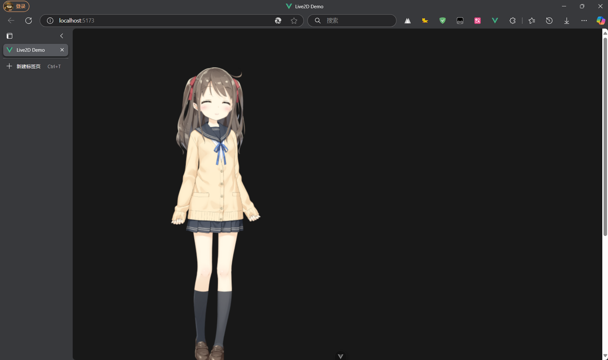

# live2d

本项目基于 Vue3，用于展示最简单的 live2d 模型使用。

## 项目结构

```bash
Live2D-demo/
├── public/
│   ├── hiyori_free_zh/          # 模型文件
│   └── live2dcubismcore.min.js  # live2d 核心加载文件
└── src/
    ├── components
    │   └── Live2D.vue           # live2d 模型组件
    └── App.vue                  # 根组件
```

其中的 `hiyori_free_zh` 文件夹是 live2d 模型文件，是可以替换成你自己喜欢的模型滴。

## 快速开始

### 安装依赖包

```sh
npm install
```

### 运行项目

```sh
npm run dev
```

## 结果预览

